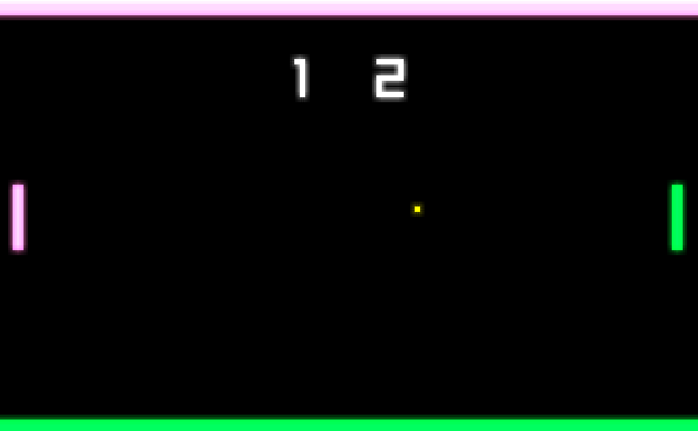

# New PONG

## Pong with a twist, created in C using Raylib

Match the color of the ball in order to hit it back!

## Controls
### Player 1
| Key | Description |
| ----------- | ----------- |
| W | Move up |
| A/D | Cycle Color |
| S | Move down |

### Player 2
| Key | Description |
| ----------- | ----------- |
| Up Arrow | Move up |
| Left/Right Arrow | Cycle Color |
| Down Arrow| Move down |

### Misc.
| Key | Description |
| ----------- | ----------- |
| P | Pause |
| Q | Quit |
